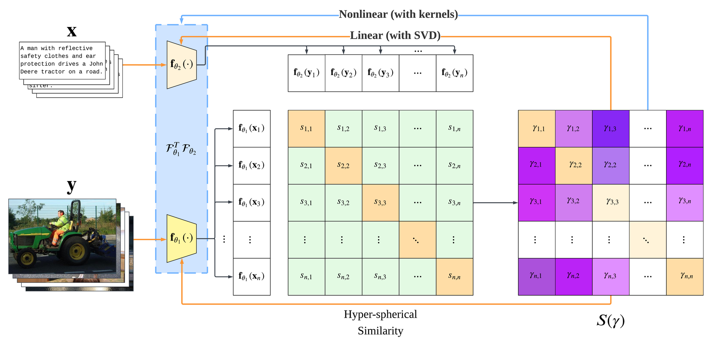
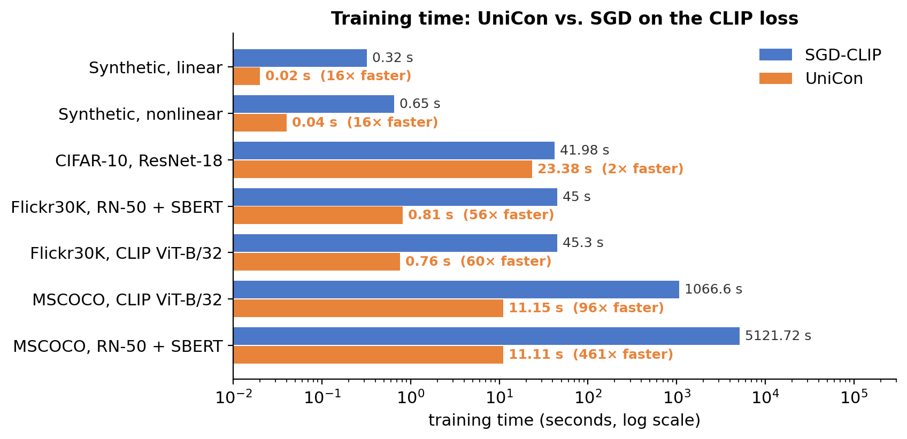
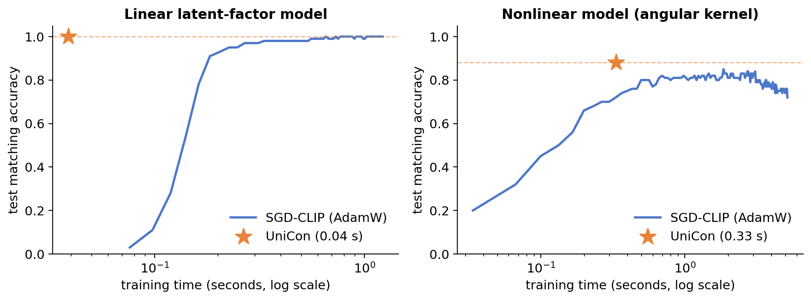
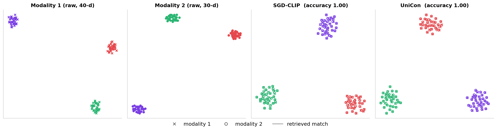
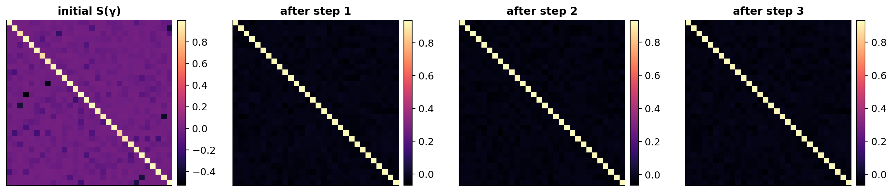

<div align="center">

# UniCon: Unified Framework for Efficient Contrastive Alignment via Kernels

**NeurIPS 2026**

[Hangke Sui](mailto:hangkes2@illinois.edu)<sup>1,3\*</sup> &nbsp;·&nbsp;
[Yuqing Wang](mailto:yuqing14@illinois.edu)<sup>2,3\*</sup> &nbsp;·&nbsp;
[Minh N. Do](mailto:minhdo@illinois.edu)<sup>1,2,3,4</sup>

<sup>1</sup>ECE, UIUC &nbsp; <sup>2</sup>Siebel School of Computing and Data Science, UIUC &nbsp;
<sup>3</sup>Coordinated Science Laboratory, UIUC &nbsp; <sup>4</sup>VinUni-Illinois Smart Health Center
<br><sup>\*</sup>Equal contribution

[](https://arxiv.org/abs/2604.16678)
[](https://arxiv.org/abs/2604.16678)
[](https://suihangke.github.io/UniCon/)
[](LICENSE)



</div>

> **TL;DR** — Training with a contrastive loss only tracks the top-*r* singular subspace of a
> weighted cross-covariance. UniCon builds that operator explicitly through a **contrastive
> similarity weight matrix** $S(\gamma)$ and solves the alignment **in closed form**: one SVD for
> linear encoders, a kernelized SVD for nonlinear encoders — instead of thousands of SGD steps.

## ✨ Highlights

- **Closed-form alignment.** Minimizing a contrastive loss is equivalent to a best rank-*r*
  approximation; no backpropagation and no learning rate.
- **Linear and nonlinear, unified.** Linear encoders are the linear-kernel case of a single RKHS
  spectral characterization.
- **Any contrastive loss.** CLIP / InfoNCE, triplet, sigmoid, and many-to-many (SupCon-style)
  alignment are all covered by one family $(\psi, \phi, \nu, \epsilon)$.
- **Up to 461× faster** than SGD on the CLIP loss, with competitive or better retrieval.

## 🧭 Method in one picture

For a batch with hyperspherical similarities $s_{ij} = \langle f_{\theta_1}(x_i), f_{\theta_2}(y_j) \rangle$,
the gradient of the generalized contrastive loss equals the gradient of a trace objective (Lemma 4):

$$
\frac{\partial \mathcal{L}}{\partial \theta_k}
= -\frac{\partial\, \mathrm{tr}\big(F_{\theta_1}(X)\, S(\gamma)\, F_{\theta_2}(Y)^\top\big)}{\partial \theta_k}\bigg|_{\gamma \text{ fixed}} .
$$

Its maximizer is known in closed form:

| | Operator | Solution |
|---|---|---|
| **Linear encoders** (Thm. 8) | $C(\gamma) = X S(\gamma) Y^\top = U \Sigma V^\top$ | $F_1^\top F_2 = \frac{1}{\rho} \sum_{i \le r} \sigma_i u_i v_i^\top$ |
| **Kernel encoders** (Thm. 9) | $M = K_X^{1/2} S(\gamma) K_Y^{1/2}$ | $AB^\top = \frac{1}{\rho} K_X^{-1/2} [M]_r K_Y^{-1/2}$ |

UniCon alternates *similarity → $S(\gamma)$ → spectral update*; the fixed point stabilizes within a
couple of steps, and mini-batch solutions are fused with validation weights.

### The core: `unicon/core/s_gamma.py`

The whole method rests on two functions, kept in their own module and written to follow the
paper line by line:

| Function | Paper |
|---|---|
| `compute_S_gamma(s, nu, psi, diff_psi, diff_phi, epsilon_ij, epsilon_ii)` | one-to-one $S(\gamma)$, Listing 1 |
| `compute_S_gamma_generalized(s, pos_mask, nu, psi, diff_psi, diff_phi, epsilon_ij, epsilon_ii)` | many-to-many $S(\gamma)$, Eq. 35–39, Listing 2 |

Both satisfy Lemma 4 exactly: $S(\gamma) = -\partial \mathcal{L} / \partial s$ for every loss in the
family, one-to-one and many-to-many.

## 📊 Results

<p align="center"></p>
<p align="center"></p>
<p align="center"></p>
<p align="center"><br>
<em>Evolution of S(γ) on the nonlinear model: positive (diagonal) and negative weights settle within a couple of updates.</em></p>

**Flickr30K** (Table 1, test split of 3,179 images, Recall@1 / Recall@10):

| Backbone | Method | Train time | I→T | T→I |
|---|---|---:|:---:|:---:|
| RN-18 + SBERT | SGD-CLIP | 45.6 s | .043 / .221 | .041 / .217 |
| | **UniCon** | **1.7 s** | .020 / .145 | **.087 / .361** |
| RN-50 + SBERT | SGD-CLIP | 45.0 s | .043 / .221 | .041 / .217 |
| | **UniCon** | **0.81 s** | **.134 / .464** | **.188 / .567** |
| CLIP ViT-B/32 | SGD-CLIP | 45.3 s | .231 / .595 | .241 / .600 |
| | **UniCon** | **0.76 s** | **.284 / .636** | **.421 / .777** |

**MSCOCO 5K test and zero-shot Flickr30K** (Table 2, trained on MSCOCO):

| Backbone | Method | Train time | I→T R@1 / R@10 | T→I R@1 / R@10 | Flickr30K R@5 I→T / T→I |
|---|---|---:|:---:|:---:|:---:|
| RN-50 + SBERT | SGD-CLIP | 5121.72 s | .053 / .253 | .060 / .286 | — |
| | **UniCon** | **11.11 s** | **.105 / .388** | **.129 / .439** | .171 / .249 |
| CLIP ViT-B/32 | SGD-CLIP | 1066.60 s | .128 / .415 | .123 / .427 | — |
| | **UniCon** | **11.15 s** | **.329 / .685** | **.292 / .644** | .808 / .766 |

Numbers reported in the paper; this repository reproduces them (see
[REPRODUCIBILITY.md](REPRODUCIBILITY.md) for a side-by-side comparison).

## 🚀 Getting started

```bash
git clone https://github.com/suihangke/UniCon.git && cd UniCon
conda env create -f unicon.yaml && conda activate unicon   # exact environment of the paper
pip install -e .
```

```python
import torch
from unicon import compute_S_gamma, clip_loss, LinearUniCon, KernelUniCon

# The core: contrastive similarity weights of a batch with similarities s (n x n)
S = compute_S_gamma(s, **clip_loss(tau=1.0).s_gamma_kwargs)

# Linear UniCon (Algorithm 1): x (N, d1), y (N, d2) paired features
model = LinearUniCon(r=128, loss=clip_loss(tau=1.0, nu=2.0), factorization="orthonormal")
model.fit(x, y, batch_size=4096, n_iters=2)
sim = model.similarity(x_test, y_test)

# Kernel UniCon (Algorithm 2)
model = KernelUniCon(r=10, kernel="angular", init="zeros")
model.fit(x, y, batch_size=30, x_val=x_val, y_val=y_val)
sim = model.similarity(x_test, y_test)
```

## 🔁 Reproducing the paper

```bash
# Section 4.1, synthetic data (CPU, seconds)
python experiments/synthetic/linear.py                                   # Figure 2
python experiments/synthetic/nonlinear.py --seeds 0 1 2 3 4 5 6 7 8 9    # Figure 3

# Table 1, Flickr30K
python experiments/flickr30k/extract_features.py --backbone clip_vit_b32  # also resnet18_minilm, resnet50_minilm
python experiments/flickr30k/run.py --backbone all

# Table 2, MSCOCO + zero-shot Flickr30K
python experiments/mscoco/extract_features.py --backbone clip_vit_b32 --train-captions 5
python experiments/mscoco/extract_features.py --backbone resnet50_minilm
python experiments/mscoco/run.py --backbone clip_vit_b32
python experiments/mscoco/run.py --backbone resnet50_minilm

# Everything, including the appendix ablations
bash scripts/reproduce.sh
```

CIFAR-10 (Section 4.2) and Clotho audio–text retrieval (Appendix C.5) are being integrated;
their interfaces are in [`experiments/cifar10`](experiments/cifar10/README.md) and
[`experiments/clotho`](experiments/clotho/README.md).
Appendix ablations (kernels, losses, SigLIP, batch size, stabilized SVD) are in [`ablations/`](ablations/README.md).

## 📁 Repository structure

```
unicon/
  core/s_gamma.py      ★ UniCon core: compute_S_gamma, compute_S_gamma_generalized
  solvers/             closed-form updates: LinearUniCon (Alg. 1), KernelUniCon (Alg. 2), SVD utils
  losses.py            contrastive loss family: CLIP, triplet, sigmoid
  kernels.py           angular, arc-cosine, cosine, RBF, Matérn, ...
  baselines.py         SGD-CLIP baseline
  eval/, data/, viz.py metrics, feature extraction, synthetic data, plotting
experiments/           main-text experiments (synthetic, Flickr30K, MSCOCO; CIFAR-10 and Clotho in progress)
ablations/             appendix ablations
scripts/reproduce.sh   runs every experiment and ablation
docs/                  project page
```

## 📝 Citation

```bibtex
@inproceedings{sui2026unicon,
  title     = {UniCon: Unified Framework for Efficient Contrastive Alignment via Kernels},
  author    = {Sui, Hangke and Wang, Yuqing and Do, Minh N.},
  booktitle = {Advances in Neural Information Processing Systems (NeurIPS)},
  year      = {2026}
}
```

## Acknowledgment

This work was supported in part by the Advanced Research Projects Agency for Health (ARPA-H)
and the IBM–Illinois Discovery Accelerator Institute.
